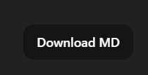

# ChatGPT Markdown Exporter

Adds a **Download MD** button on ChatGPT. Saves the **open conversation** as one Markdown file. Works on `chatgpt.com` and `chat.openai.com`.

Nothing is sent to a backend—there isn’t one. It reads the page and downloads a file like any normal save.

## Install (unpacked)

1. Clone or download this repo.
2. Chrome → `chrome://extensions` → enable **Developer mode**.
3. **Load unpacked** → select this folder (where `manifest.json` is).

## License

MIT — [LICENSE](./LICENSE).
